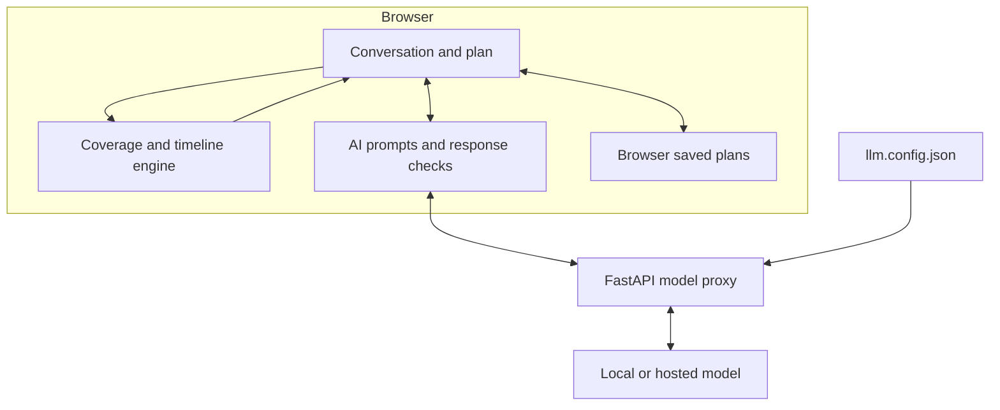

# LincolnLens

**Life’s unpredictable. Your plan doesn’t have to be.**

LincolnLens is a conversational life insurance planning prototype. Describe your household, see the financial needs behind a coverage estimate, and explore how that estimate changes as life changes.

The app shows what the money is intended to cover: the home, income support, debts, education, childcare, and immediate costs. You can change the inputs, compare coverage amounts, and take a plain-text summary to a licensed professional.

**The language model reads and explains. JavaScript calculates the plan.**

This repository is named **Life-LensV2**; the current interface uses **LincolnLens**. Estimates, premiums, health classes, and cash-value projections are educational illustrations—not quotes, underwriting decisions, or financial advice.

[Quick start](#quick-start) · [Model setup](#connecting-a-language-model) · [Architecture](#architecture) · [Calculations](#how-coverage-is-calculated) · [Privacy](#data-and-privacy) · [Troubleshooting](#deployment-and-troubleshooting)

## What you can do

- **Start with a sentence or one question at a time.** Review the facts extracted from your description, then choose a quick path or a guided walkthrough.
- **Watch the plan take shape.** A live panel separates financial needs from savings and existing coverage, with explanations for individual line items.
- **Explore different amounts.** Compare essential, balanced, and additional-cushion targets; move a coverage slider to see which goals are funded.
- **See the plan over time.** Inspect a year-by-year funding timeline, compare term and whole life, and explore a term-policy ladder when the engine offers one.
- **Include your partner’s contribution.** Build a second needs estimate covering income, childcare, household work, and family care where applicable.
- **Ask questions and make changes in conversation.** Update facts, open a plan card, change coverage, or launch a supported scenario from the composer.
- **Inspect the reasoning.** **Behind the numbers** exposes calculations, adjustable assumptions, AI activity, and a demonstration of the dollar-figure check.
- **Save and take your plan with you.** Resume browser-saved plans, copy or download a `.txt` summary, and generate an optional advisor brief. No account is required.

### The guided journey

Questions and cards appear according to the household’s answers; not everyone sees every step.

| Stage | What happens |
| --- | --- |
| **You** | Establish household, children’s ages, income, age, and priorities. |
| **Your needs** | Choose mortgage support, income duration, debts, education, childcare, immediate costs, savings to use, and existing coverage. |
| **Protection** | Explore the gap, coverage amounts, timeline, policy types, and illustrative premiums. Health questions are optional. |
| **Family** | Examine the partner’s financial contribution and a separate coverage estimate when relevant. |
| **Explore** | Compare life changes and financial shocks, then prepare a summary. |

The quick path applies editable defaults to selected unanswered questions. These are assumptions made by the application, not additional facts extracted from the user.

### What-if scenarios

| Planned changes | Financial shocks |
| --- | --- |
| A baby; a new or larger home; a raise; changing jobs; paying off debt; building savings; a partner stopping work | Job loss; illness or injury; falling investments; an unexpected bill; lower growth above inflation; supporting a parent |

Scenario previews use a copy of the profile and assumptions. Users can compare scenarios or explicitly apply a change. The illness and job-loss scenarios model the effect on savings, debts, and the subsequent coverage gap; they do not simulate a life insurance payout for those events.

## Quick start

Suggested environment: **Node.js 22+**, **npm**, and **Python 3.10+**. A model endpoint is optional for trying the guided calculator and built-in responses. Model failures fall back to local parsing or prepared explanations, although a slow endpoint can delay that fallback.

### 1. Install and build

```bash
git clone https://github.com/dineth99-bit/Life-LensV2.git
cd Life-LensV2
npm ci
npm run build

python3 -m venv .venv
source .venv/bin/activate
python -m pip install -r requirements.txt
```

On Windows, use `python -m venv .venv` and activate it with `.venv\Scripts\Activate.ps1` in PowerShell.

### 2. Review the model configuration

The active configuration is `llm.config.json` in the repository root. For a local setup with no credentials, use:

```json
{
  "backend": "local",
  "local": {
    "url": "http://127.0.0.1:8000/v1/chat/completions",
    "model": "Qwen/Qwen3.5-9B",
    "key": ""
  },
  "modal": {
    "url": "",
    "model": "Qwen/Qwen3.5-9B",
    "key": ""
  }
}
```

The model name above is the proxy’s default. Use the exact model ID served by your endpoint; the repository does not install or launch a model server.

**Credential handling:** `llm.config.json` is currently tracked by Git even though `.gitignore` lists it. Ignoring an already tracked file does not protect later edits. Remove it from tracking before storing credentials (`git rm --cached llm.config.json` keeps the local file), commit that removal, and keep any shared example free of secrets. Revoke or rotate credentials that have already been committed; deleting the current file does not remove earlier copies.

If the file is missing or cannot be parsed, `server.py` falls back to its local defaults. `llm.local.json` is ignored by Git but is not read by this server.

### 3. Start the application

```bash
python server.py
```

Open **[http://127.0.0.1:3020](http://127.0.0.1:3020)**.

The server serves the built `dist/` directory and handles model requests. It listens on `0.0.0.0:3020`; it is not restricted to localhost. To bind only to localhost instead:

```bash
python -m uvicorn server:app --host 127.0.0.1 --port 3020
```

### 4. Try the included example

Choose **Build my plan**, then **Try a young family**. Review the extracted facts, continue through the plan, move the coverage slider, and open **Behind the numbers**. In **Explore**, compare a scenario and choose **Put my plan together** to copy or download the summary.

### Frontend development

Keep the Python server running, then start Vite in a second terminal:

```bash
npm run dev
```

Vite requests port **5174** and proxies `/api` to **3020**. Use the URL printed in the terminal if that port is already occupied. Changes to source files appear through Vite; rebuild with `npm run build` to update the copy served by Python.

`npm run preview` previews the built frontend, normally on port **4173**. With the repository’s Vite configuration, preview inherits the `/api` proxy to **3020**, so keep the Python server running for AI features there too.

## Connecting a language model

`server.py` reads `llm.config.json` for each request, so switching the active block does not require a restart.

| Setting | Meaning |
| --- | --- |
| `backend` | Selects `local` or `modal`. There is no automatic failover between them. |
| `url` | Full OpenAI-style chat-completions URL, including `/v1/chat/completions` where required by the provider. |
| `model` | Model ID expected by the selected endpoint. |
| `key` | Optional token. The server adds `Authorization: Bearer <key>`; enter only the token. |

For a hosted model, set `backend` to `modal` and fill in that block’s URL, model, and key. The label selects a configuration block; it does not deploy a Modal app. Neither block provisions model infrastructure.

The proxy sends `temperature: 0.3`, `max_tokens: 2048`, `top_p: 0.9`, `stream: false`, and `reasoning_effort: "none"`, with a 120-second HTTP timeout. An endpoint must accept this request format and return text in `choices[0].message.content`. If your provider rejects an optional field such as `reasoning_effort`, adapt the request body in `server.py`.

For JSON tasks, the proxy adds an instruction requesting one JSON object and attempts to parse the response. This is prompt-based JSON handling, not enforced structured-output validation. Completed `<think>...</think>` blocks are removed from returned text.

### API checks

```bash
curl http://127.0.0.1:3020/api/backends
```

This returns the selected backend, label, model, and `ok`. For a URL ending in `/chat/completions`, the probe replaces that suffix with `/models`. **`ok: true` is only a loose reachability signal:** the current probe accepts any HTTP status below 500, including 401 and 404. It does not confirm valid credentials, an available model, or successful inference.

To test an actual completion against your configured endpoint:

```bash
curl -X POST http://127.0.0.1:3020/api/complete \
  -H 'Content-Type: application/json' \
  -d '{"prompt":"Reply with one short greeting.","json":false}'
```

| Route | Purpose |
| --- | --- |
| `GET /api/backends` | Report the configured model and probe its endpoint. |
| `POST /api/complete` | Accept `prompt` or a `messages` array, plus optional `json: true`; return text and backend metadata. JSON requests also receive a parsed `json` field. |
| `GET /` and asset paths | Serve files from `dist/`. |

## Architecture

The frontend uses **vanilla JavaScript ES modules, HTML, and CSS**, bundled with **Vite**. The backend uses **FastAPI**, **Uvicorn**, **HTTPX**, and **Pydantic**. Saved plans use browser `localStorage`; there is no application database or account system.



The browser calculates estimates and checks displayed AI prose. The Python service serves the build and forwards model requests; it does not calculate coverage or run the dollar-figure guard.

`src/client.js` installs a compatibility bridge named `window.claude`. In the normal Vite entry point, that bridge sends requests to `/api/complete`; the name does not require an Anthropic account or Claude model. The older direct-model settings in `src/ai.js` are a fallback path, not the normal configuration switch.

### Where AI contributes

| Task | Model role | Application role |
| --- | --- | --- |
| Natural-language intake | Extract household and financial details into JSON. | Sanitize fields, combine with the built-in parser, and show editable facts. |
| Conversation | Answer questions and propose a supported action. | Validate and apply actions; recompute the plan in code. |
| Plan explanation | Explain the supplied needs and coverage figures. | Supply calculated context and check displayed dollar figures. |
| Plan insights | Select and rephrase up to three observations. | Generate the candidate observations from plan rules. |
| Suggested questions | Suggest context-relevant follow-ups. | Filter suggestions and avoid exact repeats of previously asked questions. |
| Advisor brief | Draft a short handoff from the plan and recent questions. | Assemble the summary and provide copy/download controls. |

Model output can change the inputs through supported actions. Deterministic calculations make the arithmetic reproducible for a given profile; they do not guarantee that extracted facts or model explanations are correct.

**Photo reading is not enabled in the standard build.** The source contains a document-photo flow, but the current bridge advertises no image support and does not forward the image options used by that flow. Enabling it requires implementing image transport and capability reporting, plus a compatible vision endpoint. Changing only the model name is insufficient.

## How coverage is calculated

The core implementation is in [`src/engine.js`](src/engine.js), with the annuity helper in [`src/dom.js`](src/dom.js).

**Coverage gap = max(0, total modeled needs − counted resources).**

| Component | Current calculation |
| --- | --- |
| Immediate costs and other debts | Included as entered lump sums. |
| Mortgage | Full balance, half the balance, or excluded according to the selected option. |
| Income support | Selected share of annual income over the chosen duration, discounted as an annuity due. |
| Education | Selected amount per child, discounted to today from age 18; children already 18 or older have no discount. The engine includes children aged 22 or younger. |
| Childcare | Annual amount discounted over the years until the youngest child turns 13. |
| Additional support | Recurring costs, such as care for a parent, discounted over their specified duration. |
| Savings | Only the amount explicitly allocated to the plan reduces the gap. |
| Existing coverage | Counts toward resources, subject to the work-coverage setting. |

For annual support `P`, duration `n`, and annual real growth rate `r`, the present value is:

```text
P × ((1 − (1 + r)^(-n)) / r) × (1 + r)
```

At `r = 0`, this becomes `P × n`. Payments occur at the beginning of each modeled year. Education is discounted separately as a future lump sum. These are simplified planning assumptions, not forecasts of investment performance.

Defaults are **75% income replacement**, **3% annual growth above inflation**, and **count work coverage**. The first two can be adjusted in **Behind the numbers** from 50–100% and 0–5%, respectively. The work-coverage switch excludes coverage marked solely as `work`; a combined `both` amount is not split into work and personal portions.

### Coverage choices and timeline

- **Essential:** lump-sum needs plus up to five years of income support, less counted resources, floored at zero and rounded to the nearest $50,000. If this reaches the balanced tier, the engine reduces it using a 65%-of-balanced rule and rounds down.
- **Balanced:** the full positive gap rounded up to the next $50,000.
- **More cushion:** the larger of balanced plus $100,000 or 125% of balanced rounded up to $50,000. When the gap is zero, all tiers are zero.

The funding timeline starts with the selected coverage plus counted resources, pays obligations in a fixed priority order, and grows the remaining balance annually. The separate term-length projection uses simplified assumptions about needs shrinking over time, including debt and mortgage reductions; it is not a loan-amortization model.

Premium bands, health classes, policy suggestions, and whole-life cash values come from hard-coded illustrative rules. They are not live carrier rates or validated underwriting results. Linked educational resources do not validate these numerical assumptions.

### Dollar-figure checks

`guard()` detects supported **`$`-prefixed amounts**, including forms such as `$500K`, and compares them with allowed plan figures. It accepts a difference of up to **the greater of $600 or 2% of the allowed amount**. Display helpers replace unmatched figures in checked AI prose.

This is a limited consistency check. It does not verify percentages, amounts written without `$`, factual claims, or whether a matching number is used in the right context. Some stored and exported text—including the generated advisor brief—retains the original model text rather than its display-redacted version.

## Data and privacy

- Up to **30 plans** are saved in the current browser under `lincolnlens.plans.v1`. Records include profile data, assumptions, conversation history, recent Q&A, and scenario comparisons. There is no cross-device sync.
- The save routine clears both people’s structured health fields and replaces answers associated with dedicated health-question nodes. **It does not comprehensively remove sensitive information from free-text chat, Q&A, or generated text.** The interface’s “health answers are never saved” wording is broader than this implementation.
- Model requests can include extracted household facts, calculated plan figures, an estimated health class, and recent conversation turns—not only the latest message. A hosted model receives that context through the Python proxy.
- The application does not implement server-side plan storage. Model providers and hosting infrastructure may have their own logging and retention behavior.
- The page loads fonts from Google Fonts. Browser-local plan storage does not mean the page makes no external requests.
- Downloaded summaries may include an estimated health class and recent questions. Review them before sharing. Deleting a browser plan does not delete exports or provider-side records.

## Project map

| Path | Responsibility |
| --- | --- |
| [`index.html`](index.html), `family.png` | Main page shell, landing content, and background image. |
| [`src/main.js`](src/main.js), [`src/client.js`](src/client.js) | Startup and the browser-to-proxy model bridge. |
| [`src/state.js`](src/state.js) | Profile structure, initial assumptions, shared state, and educational source links. |
| [`src/engine.js`](src/engine.js) | Coverage math, timelines, illustrative pricing, partner profiles, and dollar checks. |
| [`src/flow.js`](src/flow.js) | Guided questions, plan cards, scenarios, and text export. |
| [`src/ai.js`](src/ai.js) | Prompts, parsing, chat actions, explanations, insights, and the transparency drawer. |
| [`src/hero.js`](src/hero.js) | Landing interactions, navigation, and browser plan persistence. |
| [`src/ui.js`](src/ui.js), [`src/dom.js`](src/dom.js), [`src/styles.css`](src/styles.css) | Widgets, plan rendering, helpers, and responsive styling. |
| [`server.py`](server.py), [`requirements.txt`](requirements.txt) | Python web server and dependencies. |
| [`vite.config.js`](vite.config.js), [`package.json`](package.json) | Frontend build and development commands. |
| `llm.config.json` | Runtime endpoint selection and optional credentials; currently tracked. |
| `dist/` | Built files served by Python; currently committed to the repository. |
| `lincoln.html`, `product.html`, `incoming/` | Additional HTML and assembly files; not the default Vite entry point. |

## Deployment and troubleshooting

Host the built frontend and Python proxy together, with either a local model service or a reachable remote endpoint. The web process does not require a GPU; a self-hosted model has separate hardware requirements. Static hosting alone does not provide `/api/complete`.

For a public deployment, place the Python service behind HTTPS and add access controls, request limits, and rate limiting. The repository does not include those protections, a deployment manifest, or a Modal deployment script. Keep inference credentials server-side and allow enough proxy time for model requests.

| Symptom | Check |
| --- | --- |
| Port 3020 shows old content or fails to load the page | Run `npm run build`; Python serves `dist/`, not `src/`. |
| The calculator works but AI uses built-in responses | Check the configured URL, model ID, credentials, and endpoint response. Try an actual completion. |
| `ok: true` but chat fails | The probe also treats 401/404 as reachable. Check inference separately. |
| Hosted backend returns “no endpoint” | Set the full chat-completions URL in the selected block. |
| A provider rejects the request | Check support for the fields in `server.py`, especially `reasoning_effort`. |
| Photo controls are missing | Expected with the standard text-only bridge. |
| Plans disappear or differ between URLs | Storage is scoped to the browser and origin, including port. Clearing site data, private browsing, or blocked storage can affect persistence. |

The available npm scripts are `dev`, `build`, and `preview`. No automated test suite or `test` script is included. After changing calculations or conversation behavior, check the guided path, edited inputs, scenario comparisons, saved-plan restore, and exported summary.

## Educational resources

The application links to resources configured in `src/state.js`:

- [NAIC life insurance consumer resources](https://content.naic.org/consumer/life-insurance.htm)
- [Insurance Information Institute: life insurance basics](https://www.iii.org/insurance-basics/life-insurance)
- [Social Security survivors benefits](https://www.ssa.gov/benefits/survivors/)
- [Social Security disability benefits](https://www.ssa.gov/benefits/disability/)

These are reference links. The current implementation does not retrieve their contents at runtime or implement retrieval-augmented generation.

## License

No `LICENSE` file is currently included in this repository.
