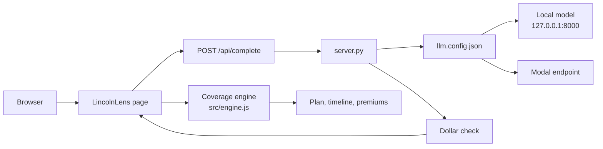
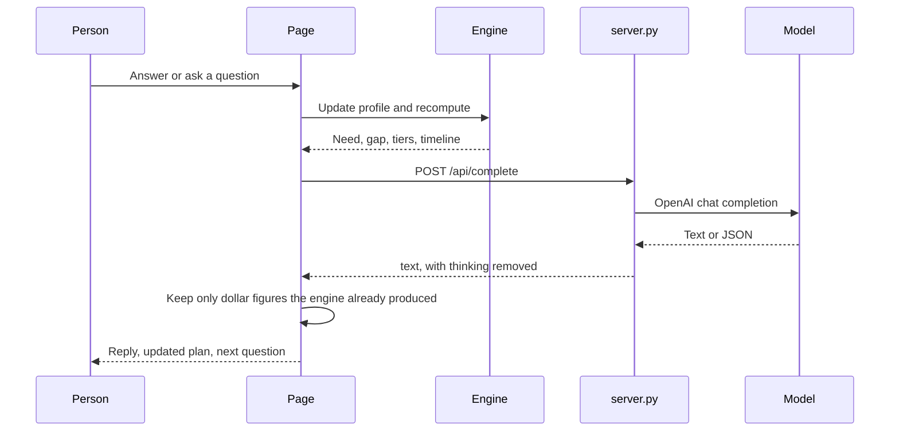

# LincolnLens

LincolnLens turns a person’s life into a coverage plan they can see and change. It asks plain questions, shows what each dollar is for, and lets them ask follow-ups in the same conversation.

The coverage math is fixed and inspectable. The model only reads what someone types and explains it. It never invents a coverage number.

This is an educational estimate, not a quote, underwriting decision, or financial advice.

## What it does

- Opens on a full-page welcome screen (`family.png`) with **Build my plan** and **Continue your last plan**.
- Walks through one guided conversation: household, needs, protection, family, then what-if scenarios.
- Builds the plan live in a side panel. Every row can be opened to see why that number is there.
- Accepts a sentence instead of the questionnaire (“I’m 34, married, two kids, $85k, $240k mortgage”).
- Lets someone type in the composer at any step. Enter sends the message.
- Suggests questions that match the current step, and does not repeat ones already asked.
- Saves plans in this browser only. Health answers are never saved.
- Shows **Behind the numbers**: the inputs, the assumptions, and a log of what the model did.

### Conversation stages

| Stage | What you learn |
|---|---|
| You | Who depends on you, ages, income, what matters most |
| Your needs | Home, mortgage, income years, debts, school, childcare, savings, coverage you already have |
| Protection | The gap, a coverage slider, a year-by-year timeline, term vs whole life, a price class if health is shared, a policy card |
| Family | A second plan if a partner depends on the household |
| Explore | Planned changes and sudden changes, plus a summary you can copy or download |

Coverage choices are three rounded amounts from the engine: essential, balanced, and more.

Scenarios include a new baby, a home, a raise, a job change, paying off debt, more savings, a partner stopping work, job loss, illness, a market drop, a surprise bill, faster inflation, and a parent who needs support.

## How the pieces fit



The page calculates. `server.py` only forwards words to whichever model `llm.config.json` selects, then strips `<think>…</think>` from the reply.



## Where AI is used

The model is reached through `window.claude` in `src/client.js`. That shim posts to `/api/complete`. `server.py` reads `llm.config.json` on every request and calls the active endpoint.

If no model answers, LincolnLens keeps going with built-in readers and canned explanations. The numbers do not change.

| Job | What the model does | What it must not do |
|---|---|---|
| Read a sentence | Pull age, household, kids, income, mortgage, debts, savings into JSON. Unknown fields stay null. | Guess a “typical” income or family |
| Answer the open question | Map a typed reply onto the widget that is waiting (an option, an amount, ages) | Skip ahead or invent an answer |
| Chat | Reply in 1–4 plain sentences and, when asked, return one action: update a field, change the policy, try a coverage amount, show a card, run a scenario, share health, or start a new plan | Calculate a new dollar amount |
| Explain the plan | Walk through the pieces the engine already listed | Add figures that are not in the plan |
| Three things I noticed | Pick up to three observations from candidates the app already found | Invent a gap or a premium |
| Advisor brief | Write a short brief from the current facts | Replace the plan math |
| Suggested questions | Propose up to three short questions about this moment | Repeat a question already asked, or include a dollar amount |
| Photo of a document | Read a benefits page, policy page, or mortgage statement into JSON | Run unless a vision model is connected |

Every model reply that shows dollars passes `guard()` in `src/engine.js`. A dollar figure is kept only when it matches a number the engine already computed (need, gap, tiers, premiums, savings, and so on). Anything else is marked so it is not presented as part of the plan.

Chat rules live in `QA_RULES` inside `src/ai.js`:

- Use only dollar figures from the plan, written the same way.
- For general insurance questions, answer in words. Do not mint new dollar amounts.
- Say “if you weren’t here” rather than “death” or “die”.
- If the person needs a lawyer, tax advisor, doctor, or a real quote, say so.
- If a message looks like a crisis, the app responds with care and points to 988 in the US. It does not discuss how policies treat suicide.

### What the proxy sends

Both local and Modal get the same body:

- `temperature`: 0.3
- `max_tokens`: 2048
- `top_p`: 0.9
- `stream`: false
- `reasoning_effort`: `"none"`

`server.py` adds `Authorization: Bearer <key>` only when that backend’s `key` is non-empty. Do not put the word `Bearer` in the config.

JSON tasks get an extra system line: reply with one JSON object, no markdown.

### Photo reading

`photoFlow()` can send an image to a vision model. The current `/api/complete` bridge reports no image support, so the photo button stays hidden. A text model does not gain vision by being connected. Point the endpoint at a vision-capable model and report image support from `limits()` before that button appears.

## Project layout

| Path | Role |
|---|---|
| `index.html` | Landing page and app shell |
| `family.png` | Landing photo |
| `src/styles.css` | Landing crop, type, and the rest of the UI |
| `src/engine.js` | All coverage, timeline, premium, and price-class math |
| `src/flow.js` | Questions, cards, and scenarios |
| `src/ai.js` | Prompts, chat actions, suggestions, number guard on replies |
| `src/client.js` | Browser bridge to `/api/complete` |
| `src/hero.js` | Landing, saved plans, composer |
| `src/ui.js` | Chat widgets and the plan panel |
| `src/state.js` | Profile, assumptions, public source links |
| `server.py` | Serves `dist/` and proxies the model |
| `llm.config.json` | `local` or `modal`. Not committed when it holds a key |
| `dist/` | What `server.py` actually serves. Rebuild after UI or photo changes |

Assumptions the engine starts with: replace 75% of income, and grow money 3% a year above inflation. Both can be changed under **Behind the numbers**. Work coverage counts unless you turn that off.

Public links used in explanations: NAIC life-insurance consumer guide, Insurance Information Institute life-insurance basics, and Social Security survivors and disability pages.

## Run it locally

You need Node 20+, Python 3.10+, and a model server on port 8000 (or a reachable Modal URL).

```bash
cd lifelensV2
npm ci
npm run build

python3 -m venv .venv
source .venv/bin/activate
pip install -r requirements.txt
```

Create `llm.config.json` in the project root (it is gitignored):

```json
{
  "backend": "local",
  "local": {
    "url": "http://127.0.0.1:8000/v1/chat/completions",
    "model": "Qwen/Qwen3.5-9B",
    "key": ""
  },
  "modal": {
    "url": "https://your-modal-host/v1/chat/completions",
    "model": "Qwen/Qwen3.5-9B",
    "key": ""
  }
}
```

Start the model, then the site.

```bash
# GPU machine, OpenAI-compatible server. Example with vLLM:
vllm serve Qwen/Qwen3.5-9B \
  --host 127.0.0.1 \
  --port 8000 \
  --gpu-memory-utilization 0.90 \
  --max-model-len 16384 \
  --reasoning-parser qwen3

# second terminal
source .venv/bin/activate
python server.py
```

Open `http://127.0.0.1:3020`.

While editing the UI, keep `server.py` running and use the Vite dev server. It proxies `/api` to port 3020:

```bash
npm run dev
```

That serves the source on `http://127.0.0.1:5174`. The copy on port 3020 is `dist/`, so production changes show up only after `npm run build`.

Switching models does not need a restart. Change `"backend"` to `"local"` or `"modal"` and save. The next chat request uses the new block.

To use Modal, set `"backend": "modal"`, put the full chat-completions URL in `modal.url`, and put the token in `modal.key` with no `Bearer` prefix. The host running `server.py` must be able to open that URL. A TLS reset from one network does not mean the token is wrong.

Check the active model:

```bash
curl http://127.0.0.1:3020/api/backends
```

`ok: true` means the proxy reached `/v1/models` on the selected endpoint.

### If vLLM fails on this machine

vLLM 0.30 can load `Qwen/Qwen3.5-9B` and then fail while FlashInfer JIT-compiles (`ninja` / GCC vs CUDA headers). Any other OpenAI-compatible server on port 8000 works with the same config. The app only needs `POST /v1/chat/completions` and `GET /v1/models`.

## Hosting

### One GPU machine (local Qwen)

Use this when the model should run next to the site.

- Instance: `g5.xlarge` (A10G, 24 GB) or similar. `t3.micro` cannot run this model.
- Image: Ubuntu Deep Learning AMI with the NVIDIA driver.
- Disk: 200 GB or more.
- Security group: SSH 22 from your IP, HTTP 80. Do not open 8000.
- On the box: clone the repo, `npm ci && npm run build`, install the Python requirements, start vLLM on `127.0.0.1:8000`, then `python server.py`.
- Put nginx on port 80 in front of 3020 if you want a normal URL. Set `proxy_read_timeout 120s`.
- Leave `"backend": "local"`.

GPU time is billed while the instance is running, even when nobody is chatting. Stop it when you are done.

### Small machine, model elsewhere

Use a `t3.small` (about 30 GB disk) for the site only, and set `"backend": "modal"` so Qwen stays on Modal. No GPU bill. Bedrock is not wired into `server.py`; adding it means a new backend that calls the Bedrock API instead of `/v1/chat/completions`.

## Privacy

- Plans live in `localStorage` under `lincolnlens.plans.v1`.
- Health answers are stripped before a plan is saved.
- Nothing in the plan is sent to a server except the text of the current model request.
- Do not commit `llm.config.json` when it contains a Modal or Hugging Face token. `llm.local.json` is also ignored.

## License and use

LincolnLens is a planning explainer. Premium ranges are illustrative class bands from the in-page engine, not carrier rates. A licensed professional still has to turn a plan into a real policy.
